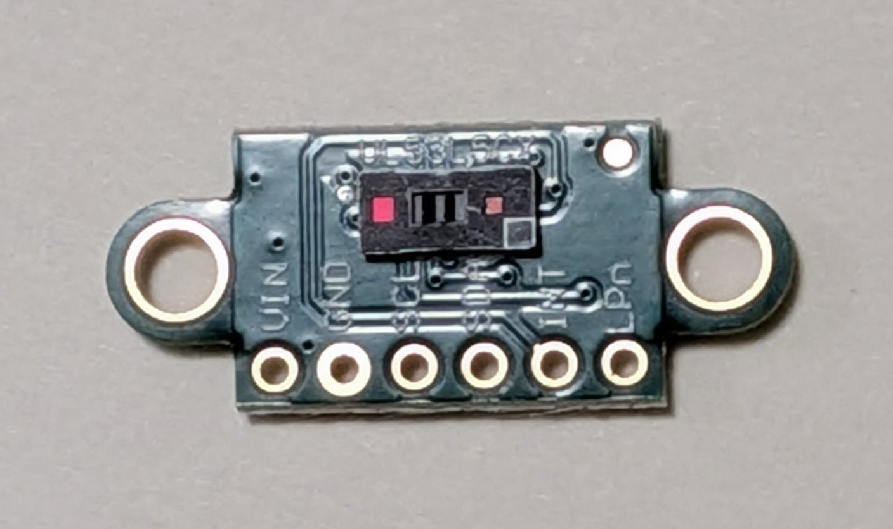
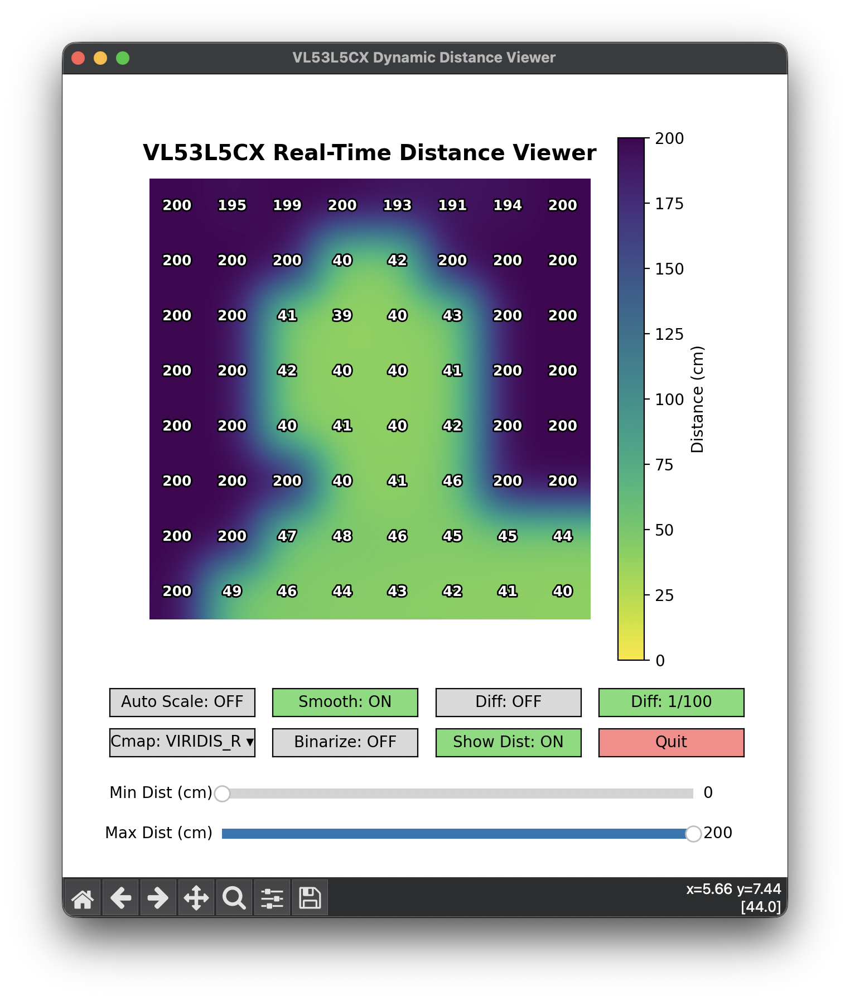
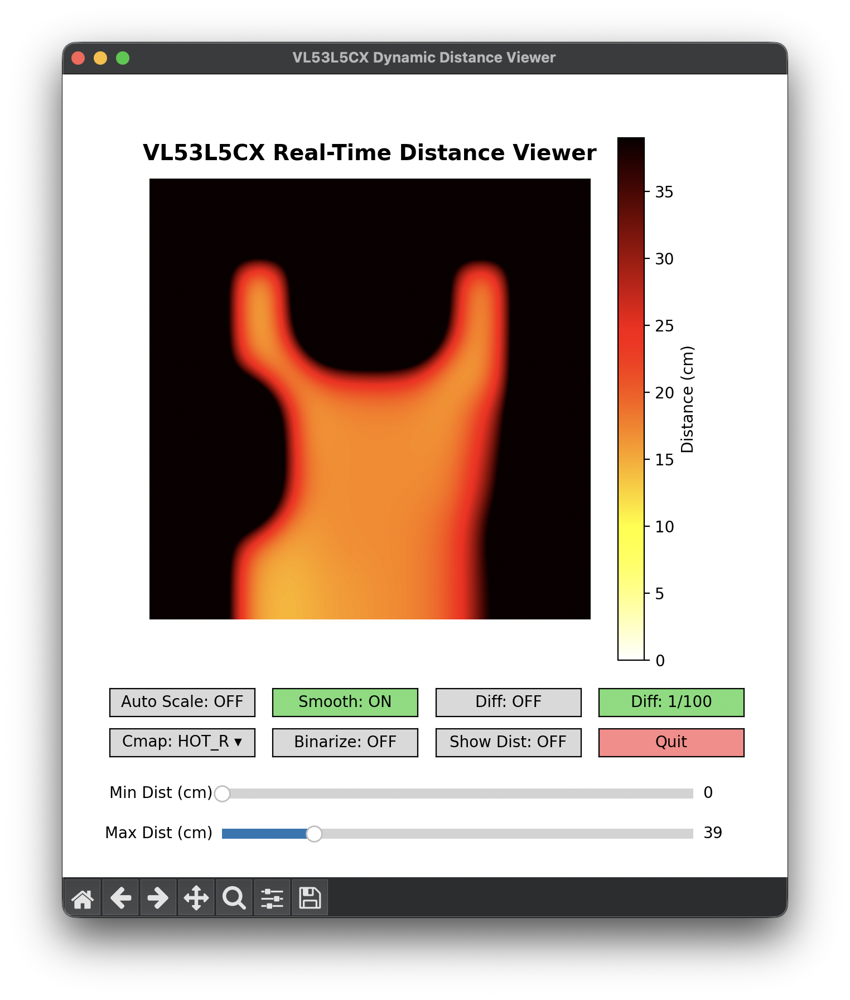
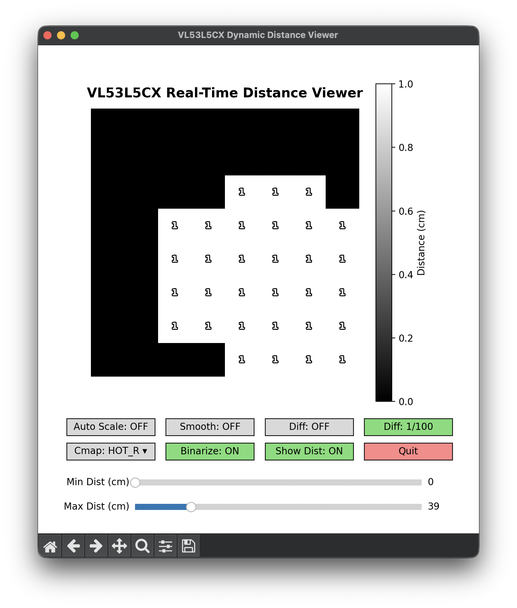

# Arduino with ToF Multizone Ranging Sensor (VL53L5CX)

(Work in Progress)



## Project Background & Retrospective

This project is a **sister project** to my previous implementation, [arduino-infrared-array-sensor](https://github.com/araobp/arduino-infrared-array-sensor), which focused on the thermal array sensor (AMG8833).
While the thermal project captured surface temperatures, this evaluation platform extends the architecture to **spatial depth mapping** using a Time-of-Flight (ToF) multizone ranging sensor. 

Leveraging an updated hardware and software workflow, the entire framework provides real-time 8x8 distance matrices, rock-solid firmware timing, and interactive desktop visualization.

## Requirements

### Hardware
*   **Microcontroller Board**: Arduino UNO R4 Minima compatible board (featuring the 32-bit Renesas RA4M1 Arm Cortex-M4 processor)
*   **Sensor Board**: VL53L5X V2 TOF Evaluation Board (STMicroelectronics 8x8 multizone Time-of-Flight sensor)

## System Architecture

```
[VL53L5X V2 EVB] --I2C (400kHz)--> [Arduino UNO R4 Minima Compatible] --USB Serial (115200bps)--> [Python GUI Viewer]
```

## Viewer

[Viewer](./python/viewer.y)



## References

- [VL53L5CX Documentation (STMicroelectronics)](https://www.st.com/en/imaging-and-photonics-solutions/vl53l5cx.html#documentation)
